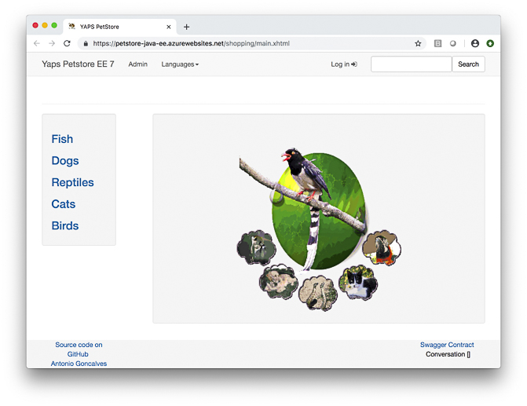

# Migrate Java EE App to Azure

This guide walks you through the process of migrating an 
existing Java EE workload to Azure, aka:
 
- Java EE app to App Service Linux and 
- App's data to Azure Database for PostgreSQL and or MySQL. 

## Table of Contents

   * [Migrate Java EE App to Azure](#migrate-java-ee-app-to-azure)
      * [What you will migrate to cloud](#what-you-will-migrate-to-cloud)
      * [What you will need](#what-you-will-need)
      * [Getting Started](#getting-started)
         * [Step ONE - Clone and Prep](#step-one---clone-and-prep)
      * [Build and Deploy Pet Store Powered Using H2](#build-and-deploy-pet-store-powered-using-h2)
        * [Build Pet Store](#build-pet-store)
        * [Deploy to WildFly in App Service Linux](#deploy-to-wildfly-in-app-service-linux)
        * [Open Pet Store running on App Service in App Service Linux](#open-pet-store-running-on-app-service-in-app-service-linux)
      * [Build and Deploy Pet Store Powered Using Azure Database for PostgreSQL](#build-and-deploy-pet-store-powered-using-azure-database-for-postgresql)
        * [Add PostgreSQL Profile](#add-postgresql-profile)
        * [Set environment variables for binding secrets at runtime](#set-environment-variables-for-binding-secrets-at-runtime)
        * [Create and Configure Petstore DB in Azure Database for PostgreSQL](#create-and-configure-petstore-db-in-azure-database-for-postgresql)
        * [Get FTP Deployment Credentials](#get-ftp-deployment-credentials)
        * [Configure PostgreSQL Data Source](#configure-postgresql-data-source)
           * [Step 1: Understand How to configure WildFly](#step-1-understand-how-to-configure-wildfly)
           * [Step 2: Upload data source artifacts to App Service linux](#step-2-upload-data-source-artifacts-to-app-service-linux)
           * [Step 3: Set PostgreSQL database connection info in the Web app environment](#step-3-set-postgresql-database-connection-info-in-the-web-app-environment)
           * [Step 4: Test the JBoss/WildFly CLI commands to configure data source](#step-4-test-the-jbosswildfly-cli-commands-to-configure-data-source)
           * [Step 5: Restart the remote WildFly app server](#step-5-restart-the-remote-wildfly-app-server)
        * [Build PetStore to interact with Azure Database for PostgreSQL](#build-petstore-to-interact-with-azure-database-for-postgresql)
        * [Deploy to App Service Linux](#deploy-to-app-service-linux)
        * [Open Pet Store running on App Service Linux and interacting with Azure Database for PostgreSQL](#open-pet-store-running-on-app-service-linux-and-interacting-with-azure-database-for-postgresql)
        * [Log into Azure Database for PostgreSQL and Validate Tables were Created and Populated](#log-into-azure-database-for-postgresql-and-validate-tables-were-created-and-populated)
        * [Trouble Shoot Petstore on Azure by Viewing Logs](#trouble-shoot-petstore-on-azure-by-viewing-logs)
      * [Build and Deploy Pet Store Powered Using Azure Database for MySQL](#build-and-deploy-pet-store-powered-using-azure-database-for-mysql)
        * [Add MySQL Profile](#add-mysql-profile)
        * [Set environment variables for binding secrets at runtime](#set-environment-variables-for-binding-secrets-at-runtime-1)
        * [Create and Configure MySQL DB in Azure Database for MySQL](#create-and-configure-mysql-db-in-azure-database-for-mysql)
        * [Configure MySQL Data Source](#configure-mysql-data-source)
           * [Step 1: Understand How to configure WildFly](#step-1-understand-how-to-configure-wildfly-1)
           * [Step 2: Upload data source artifacts to App Service linux](#step-2-upload-data-source-artifacts-to-app-service-linux-1)
           * [Step 3: Set MySQL database connection info in the Web app environment](#step-3-set-mysql-database-connection-info-in-the-web-app-environment)
           * [Step 4: Test the JBoss/WildFly CLI commands to configure data source](#step-4-test-the-jbosswildfly-cli-commands-to-configure-data-source-1)
           * [Step 5: Restart the remote WildFly app server](#step-5-restart-the-remote-wildfly-app-server-1)
        * [Build PetStore to interact with Azure Database for MySQL](#build-petstore-to-interact-with-azure-database-for-mysql)
        * [Deploy to App Service Linux](#deploy-to-app-service-linux-1)
        * [Open Pet Store running on App Service Linux and interacting with Azure Database for MySQL](#open-pet-store-running-on-app-service-linux-and-interacting-with-azure-database-for-mysql)
        * [Log into Azure Database for MySQL and Validate Tables were Created and Populated](#log-into-azure-database-for-mysql-and-validate-tables-were-created-and-populated)
        * [Trouble Shoot Petstore on Azure by Viewing Logs](#trouble-shoot-petstore-on-azure-by-viewing-logs-1)
      * [Scale out the Pet Store app](#scale-out-the-pet-store-app)
      * [Congratulations!](#congratulations)
      * [Resources](#resources)

## What you will migrate to cloud

You will migrate the famous Sun's 2003 Java EE Blue Print 
sample app. The most recent incarnation of the sample uses:

- Java SE 8
- Java EE 7
- JSR 338 Java Persistence API (JPA 2.2)
- JSR 346 Context and Dependency Injection (CDI 1.1)
- JSR 345 Enterprise Java Beans 3.2 (EJB 3.2)
- JSR 344 Java Server Faces (JSF 2.2) 
- JSR 339 Java API for RESTful Web Services (JAX-RS 2.0)
- Twitter Bootstrap (Bootstrap 3.x, JQuery 2.x, PrimeFaces 6.x) 

Upon migration, you will power the app using 
Azure Database for PostgreSQL and MySQL.

## What you will need

In order to deploy a Java Web app to cloud, you need 
an Azure subscription. If you do not already have an Azure 
subscription, you can activate your 
[MSDN subscriber benefits](https://azure.microsoft.com/pricing/member-offers/msdn-benefits-details/) 
or sign up for a 
[free Azure account]((https://azure.microsoft.com/pricing/free-trial/)).

In addition, you will need the following:

| [Azure CLI](http://docs.microsoft.com/cli/azure/overview) 
| [Java 8](https://www.azul.com/downloads/azure-only/zulu/) 
| [Maven 3](http://maven.apache.org/) 
| [Git](https://github.com/) 
| [WildFly](http://wildfly.org/downloads/)
| [PostgreSQL CLI](https://www.postgresql.org/docs/current/app-psql.html)
| [MySQL CLI](https://dev.mysql.com/downloads/shell/)
|

## Getting Started

You can start from scratch and complete each step, or 
you can bypass basic setup steps that you are already 
familiar with. Either way, you will end up with working code.

When you are finished, you can check your results 
against YOUR code in 
[migrate-Java-EE-app-to-azure/complete](https://github.com/Azure-Samples/migrate-Java-EE-app-to-azure/tree/master/complete).

You can start from [migrate-Java-EE-app-to-azure/initial-h2](https://github.com/Azure-Samples/migrate-Java-EE-app-to-azure/tree/master/initial-h2).
Or, you can clone from [agoncal-application-petstore-ee7](https://github.com/agoncal/agoncal-application-petstore-ee7) 

### Step ONE - Clone and Prep

```bash
git clone --recurse-submodules https://github.com/Azure-Samples/migrate-Java-EE-app-to-azure.git
cd migrate-Java-EE-app-to-azure
yes | cp -rf .prep/* .
```

## Build and Deploy Pet Store Powered Using H2

Open the [initial-h2/agoncal-application-petstore-ee7](https://github.com/Azure-Samples/migrate-Java-EE-app-to-azure/tree/master/initial-h2/agoncal-application-petstore-ee7)
sample app in your favorite IDE - IntelliJ | Eclipse | VS Code.

#### Build Pet Store
   ```bash
cd initial-h2/agoncal-application-petstore-ee7

bash-3.2$ mvn package -Dmaven.test.skip=true
[INFO] Scanning for projects...
[INFO] 
[INFO] ------------------------------------------------------------------------
[INFO] Building Petstore application using Java EE 7 7.0
[INFO] ------------------------------------------------------------------------
[INFO] 
[INFO] --- maven-clean-plugin:2.5:clean (default-clean) @ petstoreee7 ---
...
...
[INFO] --- maven-war-plugin:3.1.0:war (default-war) @ petstoreee7 ---
[INFO] Packaging webapp
[INFO] Assembling webapp [petstoreee7] in [/Users/selvasingh/migrate-Java-EE-app-to-azure/initial-h2/agoncal-application-petstore-ee7/target/applicationPetstore]
[INFO] Processing war project
[INFO] Copying webapp resources [/Users/selvasingh/migrate-Java-EE-app-to-azure/initial-h2/agoncal-application-petstore-ee7/src/main/webapp]
[INFO] Webapp assembled in [440 msecs]
[INFO] Building war: /Users/selvasingh/migrate-Java-EE-app-to-azure/initial-h2/agoncal-application-petstore-ee7/target/applicationPetstore.war
[INFO] ------------------------------------------------------------------------
[INFO] BUILD SUCCESS
[INFO] ------------------------------------------------------------------------
[INFO] Total time: 5.340 s
[INFO] Finished at: 2018-12-21T14:46:35-08:00
[INFO] Final Memory: 33M/326M
[INFO] ------------------------------------------------------------------------

   ```
    
#### Deploy to WildFly in App Service Linux

Login to Azure by using the 'az login' command and follow the instructions that give a device code to be entered in browser

```bash
az login
```
Set environment variables for binding secrets at runtime, 
particularly Azure resource group and Web app names. You can 
export them to your local environment, say using the supplied
Bash shell script template.

```bash
cp set-env-variables-template.sh .scripts/set-env-variables.sh
```

Modify `.scripts/set-env-variables.sh` and set Azure Resource Group name, 
App Service Web App Name, Azure Region and WildFly directory in
 the local machine. Then, set environment variables:
 
```bash
source .scripts/set-env-variables.sh
```
 
Add [Maven Plugin for Azure App Service](https://github.com/Microsoft/azure-maven-plugins/blob/develop/azure-webapp-maven-plugin/README.md) configuration to POM.xml and deploy
Pet Store to WildFly in App Service Linux:

```xml    
<plugins> 

    <!--*************************************************-->
    <!-- Deploy to WildFly in App Service Linux          -->
    <!--*************************************************-->
       
    <plugin>
        <groupId>com.microsoft.azure</groupId>
        <artifactId>azure-webapp-maven-plugin</artifactId>
        <version>1.5.1</version>
        <configuration>
    
            <!-- Web App information -->
            <resourceGroup>${RESOURCEGROUP_NAME}</resourceGroup>
            <appServicePlanName>${WEBAPP_PLAN_NAME}</appServicePlanName>
            <appName>${WEBAPP_NAME}</appName>
            <region>${REGION}</region>
    
            <!-- Java Runtime Stack for Web App on Linux-->
            <linuxRuntime>wildfly 14-jre8</linuxRuntime>
    
        </configuration>
    </plugin>
    ...
</plugins>
```
 
Deploy to App Service Linux:

```bash
mvn azure-webapp:deploy

[INFO] Scanning for projects...
[INFO] 
[INFO] ------------------------------------------------------------------------
[INFO] Building Petstore application using Java EE 7 7.0
[INFO] ------------------------------------------------------------------------
[INFO] 
[INFO] --- azure-webapp-maven-plugin:1.5.1:deploy (default-cli) @ petstoreee7 ---
[INFO] Authenticate with Azure CLI 2.0
[INFO] Target Web App doesn't exist. Creating a new one...
[INFO] Creating App Service Plan 'petstore-java-ee-appservice-plan'...
[INFO] Successfully created App Service Plan.
[INFO] Successfully created Web App.
[INFO] Trying to deploy artifact to petstore-java-ee...
[INFO] Deploying the war file...
[INFO] Successfully deployed the artifact to https://petstore-java-ee.azurewebsites.net
[INFO] ------------------------------------------------------------------------
[INFO] BUILD SUCCESS
[INFO] ------------------------------------------------------------------------
[INFO] Total time: 02:19 min
[INFO] Finished at: 2018-12-21T14:51:08-08:00
[INFO] Final Memory: 61M/628M
[INFO] ------------------------------------------------------------------------
```
    
#### Open Pet Store running on App Service in App Service Linux

```bash
open https://petstore-java-ee.azurewebsites.net
```


When you are finished, you can check your results 
against YOUR code in 
[migrate-Java-EE-app-to-azure/initial-postgresql](https://github.com/Azure-Samples/migrate-Java-EE-app-to-azure/tree/master/initial-postgresql).

## Build and Deploy Pet Store Powered Using Azure Database for PostgreSQL

Start your next leg of your journey ... change directory:

```bash
cd ../../initial-postgresql/agoncal-application-petstore-ee7
```

#### Add PostgreSQL Profile

Add a new profile for PostgreSQL in `pom.xml`:

```xml
<profile>
  <id>postgresql</id>
  <activation>
    <property>
      <name>db</name>
      <value>postgresql</value>
    </property>
  </activation>
  <build>

    <plugins>

      <!-- copy the correct persistence.xml file -->
      <plugin>
        <groupId>com.coderplus.maven.plugins</groupId>
        <artifactId>copy-rename-maven-plugin</artifactId>
        <version>1.0</version>
        <executions>
          <execution>
            <id>copy-file</id>
            <phase>validate</phase>
            <goals>
              <goal>copy</goal>
            </goals>
            <configuration>
              <sourceFile>${project.basedir}/src/main/resources/META-INF/persistence-postgresql.xml</sourceFile>
              <destinationFile>${project.basedir}/src/main/resources/META-INF/persistence.xml</destinationFile>
            </configuration>
          </execution>
        </executions>
      </plugin>

    </plugins>
  </build>
</profile>
``` 

#### Set environment variables for binding secrets at runtime

```bash
cp set-env-variables-template.sh .scripts/set-env-variables.sh
```

Modify `.scripts/set-env-variables.sh` and set Azure Resource Group name, 
App Service Web App Name, Azure Region, WildFly directory in
 the local machine and PostgreSQL server info. 
 Then, set environment variables:
 
```bash
source .scripts/set-env-variables.sh
```

#### Create and Configure Petstore DB in Azure Database for PostgreSQL

Create a Petstore DB using Azure CLI and PostgreSQL CLI:

```bash
az postgres server create --resource-group ${RESOURCEGROUP_NAME} \
    --name ${POSTGRES_SERVER_NAME} \
    --location ${REGION} \
    --admin-user ${POSTGRES_SERVER_ADMIN_LOGIN_NAME} \
    --admin-password ${POSTGRES_PASSWORD} \
    --sku-name GP_Gen4_2 --version 9.6

az postgres server firewall-rule create \
    --resource-group ${RESOURCEGROUP_NAME} \
    --server ${POSTGRES_SERVER_NAME} --name allAzureIPs \
    --start-ip-address 0.0.0.0 --end-ip-address 0.0.0.0

az postgres server firewall-rule create \
    --resource-group ${RESOURCEGROUP_NAME} \
    --server ${POSTGRES_SERVER_NAME} --name myDevBox \
    --start-ip-address 98.237.176.135 --end-ip-address 98.237.176.135

psql --host=${POSTGRES_SERVER_FULL_NAME} --port=5432 \
    --username=${POSTGRES_SERVER_ADMIN_FULL_NAME} \
    --dbname=${POSTGRES_DATABASE_NAME} --set=sslmode=require

Password for user postgres@petstore-db:
psql (11.1, server 9.6.10)
SSL connection (protocol: TLSv1.2, cipher: ECDHE-RSA-AES256-SHA384, bits: 256, compression: off)
Type "help" for help.

postgres=> \l
                                                               List of databases
       Name        |      Owner      | Encoding |          Collate           |           Ctype            |          Access privileges          
-------------------+-----------------+----------+----------------------------+----------------------------+-------------------------------------
 azure_maintenance | azure_superuser | UTF8     | English_United States.1252 | English_United States.1252 | azure_superuser=CTc/azure_superuser
 azure_sys         | azure_superuser | UTF8     | English_United States.1252 | English_United States.1252 | 
 postgres          | azure_superuser | UTF8     | English_United States.1252 | English_United States.1252 | 
 template0         | azure_superuser | UTF8     | English_United States.1252 | English_United States.1252 | =c/azure_superuser                 +
                   |                 |          |                            |                            | azure_superuser=CTc/azure_superuser
 template1         | azure_superuser | UTF8     | English_United States.1252 | English_United States.1252 | =c/azure_superuser                 +
                   |                 |          |                            |                            | azure_superuser=CTc/azure_superuser
(5 rows)

postgres=> \q
```

When you migrate Java workloads to cloud, you will be considering moving data to cloud. 
To accelerate your transition to cloud, 
Azure offers plenty of options to [migrate your data](https://azure.microsoft.com/en-us/services/database-migration/) 
to cloud.

Also, for your convenience, there is a [cheat sheet for PostgreSQL CLI](http://www.postgresqltutorial.com/postgresql-cheat-sheet/).

#### Get FTP Deployment Credentials

Use Azure CLI to get FTP deployment credentials:

```bash
az webapp deployment list-publishing-profiles -g ${RESOURCEGROUP_NAME} -n ${WEBAPP_NAME}
...
...
{
   ...
   ...
    "profileName": "petstore-java-ee - FTP",
    "publishMethod": "FTP",
    "publishUrl": "ftp://waws-prod-bay-063.ftp.azurewebsites.windows.net/site/wwwroot",
    "userName": "petstore-java-ee\\$petstore-java-ee",
    "userPWD": "============MASKED===========================================",
    "webSystem": "WebSites"
  }
```

Store FTP host name, say `waws-prod-bay-063.ftp.azurewebsites.windows.net`, user name and user password in .scripts/set-env-variables.sh file.

#### Configure PostgreSQL Data Source

There are 5 steps to configure a data source. These steps are similar to configuring data sources 
in any on premise Java EE app servers:

##### Step 1: Understand How to configure WildFly

In App Service, each instance of an app server is stateless. Therefore, each instance must be 
configured on startup to support a Wildfly configuration needed by your application. You can configure at 
startup by supplying a startup Bash script that calls [JBoss/WildFly CLI commands](https://docs.jboss.org/author/display/WFLY/Command+Line+Interface) to setup data sources, messaging 
 providers and any other dependencies. We will create a startup.sh script and place it in the `/home` 
 directory of the Web app. The script will:
 
Install a WildFly module:

```bash
# where resources point to JDBC driver for PostgreSQL
# and module xml points to module description, see below

module add --name=org.postgres --resources=/home/site/deployments/tools/postgresql-42.2.5.jar --module-xml=/home/site/deployments/tools/postgresql-module.xml
```
Where `postgresql-module.xml` describes the module:

```xml
<?xml version="1.0" ?>
<module xmlns="urn:jboss:module:1.1" name="org.postgres">
    <resources>
     <!-- ***** IMPORTANT : PATH should point to PostgreSQL Java driver on App Service Linux *******-->
       <resource-root path="/home/site/deployments/tools/postgresql-42.2.5.jar" />
    </resources>
    <dependencies>
        <module name="javax.api"/>
        <module name="javax.transaction.api"/>
    </dependencies>
</module>
```
 
Add a JDBC driver for PostgreSQL:

```bash
/subsystem=datasources/jdbc-driver=postgres:add(driver-name="postgres",driver-module-name="org.postgres",driver-class-name=org.postgresql.Driver,driver-xa-datasource-class-name=org.postgresql.xa.PGXADataSource)
```

Install a data source by using the data-source shortcut command:

```bash
data-source add --name=postgresDS --driver-name=postgres --jndi-name=java:jboss/datasources/postgresDS --connection-url=${POSTGRES_CONNECTION_URL,env.POSTGRES_CONNECTION_URL:jdbc:postgresql://db:5432/postgres} --user-name=${POSTGRES_SERVER_ADMIN_FULL_NAME,env.POSTGRES_SERVER_ADMIN_FULL_NAME:postgres} --password=${POSTGRES_SERVER_ADMIN_PASSWORD,env.POSTGRES_SERVER_ADMIN_PASSWORD:example} --use-ccm=true --max-pool-size=5 --blocking-timeout-wait-millis=5000 --enabled=true --driver-class=org.postgresql.Driver --exception-sorter-class-name=org.jboss.jca.adapters.jdbc.extensions.postgres.PostgreSQLExceptionSorter --jta=true --use-java-context=true --valid-connection-checker-class-name=org.jboss.jca.adapters.jdbc.extensions.postgres.PostgreSQLValidConnectionChecker
```

A server reload may be required for the changes to take effect:

```bash
reload --use-current-server-config=true
```

These JBoss CLI commands, JDBC driver for PostgreSQL and module XML are available in 
[initial-postgresql/agoncal-application-petstore-ee7/.scripts](https://github.com/Azure-Samples/migrate-Java-EE-app-to-azure/tree/master/initial-postgresql/agoncal-application-petstore-ee7/.scripts) 

Also, you can directly download the latest version of [JDBC driver for PostgreSQL](https://jdbc.postgresql.org/download.html)

##### Step 2: Upload data source artifacts to App Service linux

Open an FTP connection to App Service Linux to upload data source artifacts:

```bash
pwd
/Users/selvasingh/migrate-Java-EE-app-to-azure/initial-postgresql/agoncal-application-petstore-ee7

cd .scripts

ftp
ftp> open waws-prod-bay-063.drip.azurewebsites.windows.net
Trying 23.99.84.148...
Connected to waws-prod-bay-063.drip.azurewebsites.windows.net.
220 Microsoft FTP Service
Name (waws-prod-bay-063.drip.azurewebsites.windows.net:selvasingh): 
331 Password required
Password: 
230 User logged in.
Remote system type is Windows_NT.
ftp> ascii
200 Type set to A.

# Upload startup.sh to /home directory
ftp> put startup.sh
local: startup.sh remote: startup.sh
229 Entering Extended Passive Mode (|||10204|)
125 Data connection already open; Transfer starting.
100% |************************************************|   236       39.33 KiB/s    --:-- ETA
226 Transfer complete.
236 bytes sent in 00:00 (5.01 KiB/s)

# Upload CLI Commands, Module XML and JDBC Driver for PostgreSQL to /home/site/deployments/tools
ftp> cd site/deployments/tools
250 CWD command successful.
ftp> put postgresql-datasource-commands.cli 
local: postgresql-datasource-commands.cli remote: postgresql-datasource-commands.cli
229 Entering Extended Passive Mode (|||10205|)
125 Data connection already open; Transfer starting.
100% |************************************************|  1444      234.94 KiB/s    --:-- ETA
226 Transfer complete.
1444 bytes sent in 00:00 (32.31 KiB/s)
ftp> put postgresql-module.xml 
local: postgresql-module.xml remote: postgresql-module.xml
229 Entering Extended Passive Mode (|||10206|)
125 Data connection already open; Transfer starting.
100% |************************************************|   404      192.17 KiB/s    --:-- ETA
226 Transfer complete.
404 bytes sent in 00:00 (5.86 KiB/s)
ftp> binary
200 Type set to I.
ftp> put postgresql-42.2.5.jar 
local: postgresql-42.2.5.jar remote: postgresql-42.2.5.jar
229 Entering Extended Passive Mode (|||10207|)
125 Data connection already open; Transfer starting.
100% |************************************************|   806 KiB  506.52 KiB/s    00:00 ETA
226 Transfer complete.
825943 bytes sent in 00:01 (469.59 KiB/s)
ftp> bye
221 Goodbye.
```

##### Step 3: Set PostgreSQL database connection info in the Web app environment

Use Azure CLI to set database connection info:
   
```bash
az webapp config appsettings set \
 --resource-group ${RESOURCEGROUP_NAME} --name ${WEBAPP_NAME} \
 --settings \
 POSTGRES_CONNECTION_URL=${POSTGRES_CONNECTION_URL} \
 POSTGRES_SERVER_ADMIN_PASSWORD=${POSTGRES_SERVER_ADMIN_PASSWORD} \
 POSTGRES_SERVER_ADMIN_FULL_NAME=${POSTGRES_SERVER_ADMIN_FULL_NAME}

[
 {
   "name": "WEBSITE_HTTPLOGGING_RETENTION_DAYS",
   "slotSetting": false,
   "value": "3"
 },
 {
   "name": "POSTGRES_CONNECTION_URL",
   "slotSetting": false,
   "value": "jdbc:postgresql://petstore-db.postgres.database.azure.com:5432/postgres?ssl=true"
 },
 {
   "name": "POSTGRES_SERVER_ADMIN_PASSWORD",
   "slotSetting": false,
   "value": "======= MASKED ======="
 },
 {
   "name": "POSTGRES_SERVER_ADMIN_FULL_NAME",
   "slotSetting": false,
   "value": "postgres@petstore-db"
 }
] 
 
```

##### Step 4: Test the JBoss/WildFly CLI commands to configure data source

You can test Bash script for configuring data source by running them on App Service Linux 
by [opening an SSH connection from your development machine](https://docs.microsoft.com/en-us/azure/app-service/containers/app-service-linux-ssh-support#open-ssh-session-from-remote-shell):

```bash
# ======== first terminal window =========
az webapp remote-connection create --resource-group ${RESOURCEGROUP_NAME} --name ${WEBAPP_NAME} &
[18] 7422
bash-3.2$ Auto-selecting port: 60029
SSH is available { username: root, password: Docker! }
Start your favorite client and connect to port 60029
Websocket tracing disabled, use --verbose flag to enable
Successfully connected to local server..

# ======== second terminal window ========
ssh root@localhost -p 60029
The authenticity of host '[localhost]:60029 ([127.0.0.1]:60029)' can't be established.
ECDSA key fingerprint is SHA256:Lys3Kd4sNJc7X8LVMRP89GKbOzlOGp03tGYj+mY4Kic.
Are you sure you want to continue connecting (yes/no)? yes
Warning: Permanently added '[localhost]:60029' (ECDSA) to the list of known hosts.
root@localhost's password:
  _____
  /  _  \ __________ _________   ____
 /  /_\  \___   /  |  \_  __ \_/ __ \
/    |    \/    /|  |  /|  | \/\  ___/
\____|__  /_____ \____/ |__|    \___  >
        \/      \/                  \/
A P P   S E R V I C E   O N   L I N U X

Documentation: http://aka.ms/webapp-linux
c315a18b39d2:/home#

#========= open a vi window to edit startup.sh ============
c315a18b39d2:/home# vi startup.sh

# ======== vi window =====================
#!/usr/bin/env bash^M
/opt/jboss/wildfly/bin/jboss-cli.sh -c --file=/home/site/deployments/tools/postgresql-datasource-commands.cli^M
~

remove those '^M' end of line characters and save the file

# ======== run JBoss/WildFly CLI commands to configure a data source ===========

c315a18b39d2:/home# /opt/jboss/wildfly/bin/jboss-cli.sh --connect
Picked up _JAVA_OPTIONS: -Djava.net.preferIPv4Stack=true

[standalone@localhost:9990 /] module add --name=org.postgres --resources=/home/site/deployments/tools/postgresql-42.2.5.jar --module-xml=/home/site/deployments/tools/postgresql-module.xml
[standalone@localhost:9990 /] /subsystem=datasources/jdbc-driver=postgres:add(driver-name="postgres",driver-module-name="org.postgres",driver-class-name=org.postgresql.Driver,driver-xa-datasource-class-name=org.postgresql.xa.PGXADataSource)
{"outcome" => "success"}

[standalone@localhost:9990 /] data-source add --name=postgresDS --driver-name=postgres --jndi-name=java:jboss/datasources/postgresDS --connection-url=${POSTGRES_CONNECTION_URL,env.POSTGRES_CONNECTION_URL:jdbc:postgresql://db:5432/postgres} --user-name=${POSTGRES_SERVER_ADMIN_FULL_NAME,env.POSTGRES_SERVER_ADMIN_FULL_NAME:postgres} --password=${POSTGRES_SERVER_ADMIN_PASSWORD,env.POSTGRES_SERVER_ADMIN_PASSWORD:example} --use-ccm=true --max-pool-size=5 --blocking-timeout-wait-millis=5000 --enabled=true --driver-class=org.postgresql.Driver --exception-sorter-class-name=org.jboss.jca.adapters.jdbc.extensions.postgres.PostgreSQLExceptionSorter --jta=true --use-java-context=true --valid-connection-checker-class-name=org.jboss.jca.adapters.jdbc.extensions.postgres.PostgreSQLValidConnectionChecker
[standalone@localhost:9990 /] /subsystem=datasources/data-source=postgresDS:test-connection-in-pool()
{
    "outcome" => "success",
    "result" => [true]
}
``` 

##### Step 5: Restart the remote WildFly app server

Use Azure CLI to restart the remote WildFly app server:
   
```bash
az webapp stop -g ${RESOURCEGROUP_NAME} -n ${WEBAPP_NAME}
az webapp start -g ${RESOURCEGROUP_NAME} -n ${WEBAPP_NAME}
```

For additional info, please refer to: 

- [JBoss Data Source Management](https://access.redhat.com/documentation/en-us/red_hat_jboss_enterprise_application_platform/7.0/html/configuration_guide/datasource_management).
- [JBoss/WildFly CLI Guide](https://docs.jboss.org/author/display/WFLY/Command+Line+Interface)
- [Open SSH session from your development machine to App Service Linux](https://docs.microsoft.com/en-us/azure/app-service/containers/app-service-linux-ssh-support#open-ssh-session-from-remote-shell)


#### Build PetStore to interact with Azure Database for PostgreSQL

```bash
# Use the Maven profile for PostgreSQL to build

mvn package -Dmaven.test.skip=true -Ddb=postgresql
[INFO] Scanning for projects...
[INFO] 
[INFO] ------------------------------------------------------------------------
[INFO] Building Petstore application using Java EE 7 7.0
[INFO] ------------------------------------------------------------------------
[INFO] 
[INFO] --- copy-rename-maven-plugin:1.0:copy (copy-file) @ petstoreee7 ---
[INFO] Copied /Users/selvasingh/migrate-Java-EE-app-to-azure/initial-postgresql/agoncal-application-petstore-ee7/src/main/resources/META-INF/persistence-postgresql.xml to /Users/selvasingh/migrate-Java-EE-app-to-azure/initial-postgresql/agoncal-application-petstore-ee7/src/main/resources/META-INF/persistence.xml
...
...
[INFO] --- maven-war-plugin:3.1.0:war (default-war) @ petstoreee7 ---
[INFO] Packaging webapp
[INFO] Assembling webapp [petstoreee7] in [/Users/selvasingh/migrate-Java-EE-app-to-azure/initial-postgresql/agoncal-application-petstore-ee7/target/applicationPetstore]
[INFO] Processing war project
[INFO] Copying webapp resources [/Users/selvasingh/migrate-Java-EE-app-to-azure/initial-postgresql/agoncal-application-petstore-ee7/src/main/webapp]
[INFO] Webapp assembled in [243 msecs]
[INFO] Building war: /Users/selvasingh/migrate-Java-EE-app-to-azure/initial-postgresql/agoncal-application-petstore-ee7/target/applicationPetstore.war
[INFO] ------------------------------------------------------------------------
[INFO] BUILD SUCCESS
[INFO] ------------------------------------------------------------------------
[INFO] Total time: 4.161 s
[INFO] Finished at: 2018-12-21T16:27:42-08:00
[INFO] Final Memory: 31M/513M
[INFO] ------------------------------------------------------------------------
```

#### Deploy to App Service Linux 

Deploy to WildFly in App Service Linux:

```bash
mvn azure-webapp:deploy
[INFO] Scanning for projects...
[INFO] 
[INFO] ------------------------------------------------------------------------
[INFO] Building Petstore application using Java EE 7 7.0
[INFO] ------------------------------------------------------------------------
[INFO] 
[INFO] --- azure-webapp-maven-plugin:1.5.1:deploy (default-cli) @ petstoreee7 ---
[INFO] Authenticate with Azure CLI 2.0
[INFO] Updating target Web App...
[INFO] Successfully updated Web App.
[INFO] Trying to deploy artifact to petstore-java-ee...
[INFO] Deploying the war file...
[INFO] Successfully deployed the artifact to https://petstore-java-ee.azurewebsites.net
[INFO] ------------------------------------------------------------------------
[INFO] BUILD SUCCESS
[INFO] ------------------------------------------------------------------------
[INFO] Total time: 04:07 min
[INFO] Finished at: 2018-12-21T16:45:12-08:00
[INFO] Final Memory: 60M/631M
[INFO] ------------------------------------------------------------------------
```

#### Open Pet Store running on App Service Linux and interacting with Azure Database for PostgreSQL

```bash
open https://petstore-java-ee.azurewebsites.net
```


#### Log into Azure Database for PostgreSQL and Validate Tables were Created and Populated

```bash
psql --host=${POSTGRES_SERVER_FULL_NAME} --port=5432 \
     --username=${POSTGRES_SERVER_ADMIN_FULL_NAME} \
     --dbname=${POSTGRES_DATABASE_NAME} --set=sslmode=require
Password for user postgres@petstore-db: 
psql (11.1, server 9.6.10)
SSL connection (protocol: TLSv1.2, cipher: ECDHE-RSA-AES256-SHA384, bits: 256, compression: off)
Type "help" for help.

postgres=> \l
postgres=> \dt
               List of relations
 Schema |        Name        | Type  |  Owner   
--------+--------------------+-------+----------
 public | category           | table | postgres
 public | country            | table | postgres
 public | customer           | table | postgres
 public | item               | table | postgres
 public | order_line         | table | postgres
 public | product            | table | postgres
 public | purchase_order     | table | postgres
 public | t_order_order_line | table | postgres
(8 rows)

postgres=> select name from category;
   name   
----------
 Fish
 Dogs
 Reptiles
 Cats
 Birds
(5 rows)

postgres=> \q
bash-3.2$ 

```

#### Trouble Shoot Petstore on Azure by Viewing Logs

Configure logs for the deployed Java Web 
app in App Service Linux:

```bash
az webapp log config --name ${WEBAPP_NAME} \
 --resource-group ${RESOURCEGROUP_NAME} \
  --web-server-logging filesystem
```

Open Java Web app remote log stream from a local machine:

```bash
az webapp log tail --name ${WEBAPP_NAME} \
 --resource-group ${RESOURCEGROUP_NAME}

2018-12-22T00:47:48  Welcome, you are now connected to log-streaming service.
2018-12-22T00:41:45.064280703Z   _____                               
2018-12-22T00:41:45.064325203Z   /  _  \ __________ _________   ____  
2018-12-22T00:41:45.064331403Z  /  /_\  \___   /  |  \_  __ \_/ __ \ 
2018-12-22T00:41:45.064335603Z /    |    \/    /|  |  /|  | \/\  ___/ 
2018-12-22T00:41:45.064339403Z \____|__  /_____ \____/ |__|    \___  >
2018-12-22T00:41:45.064343503Z         \/      \/                  \/ 
2018-12-22T00:41:45.064347403Z A P P   S E R V I C E   O N   L I N U X  
...
...
2018-12-22T00:41:47.124232726Z ***Copying /home/site/wwwroot/webapps/ROOT to /opt/jboss/wildfly/standalone/deployments/ROOT.war
2018-12-22T00:41:48.193646648Z ***Creating marker file /opt/jboss/wildfly/standalone/deployments/ROOT.war.dodeploy
...
...
2018-12-22T00:41:52.895075005Z 00:41:52,770 INFO  [org.jboss.modules] (main) JBoss Modules version 1.8.6.Final
2018-12-22T00:41:55.713960188Z 00:41:55,704 INFO  [org.jboss.msc] (main) JBoss MSC version 1.4.3.Final
2018-12-22T00:41:55.817008239Z 00:41:55,816 INFO  [org.jboss.threads] (main) JBoss Threads version 2.3.2.Final
2018-12-22T00:41:57.201980849Z 00:41:57,201 INFO  [org.jboss.as] (MSC service thread 1-2) WFLYSRV0049: WildFly Full 14.0.1.Final (WildFly Core 6.0.2.Final) starting
...
...
2018-12-22T00:42:19.043814396Z 00:42:19,043 INFO  [org.jboss.as.connector.subsystems.datasources] (ServerService Thread Pool -- 41) WFLYJCA0005: Deploying non-JDBC-compliant driver class org.postgresql.Driver (version 42.2)
2018-12-22T00:42:19.050046930Z 00:42:19,042 INFO  [org.jboss.as.security] (MSC service thread 1-2) WFLYSEC0001: Current PicketBox version=5.0.3.Final
2018-12-22T00:42:19.086580525Z 00:42:19,086 INFO  [org.wildfly.extension.undertow] (MSC service thread 1-1) WFLYUT0003: Undertow 2.0.13.Final starting
2018-12-22T00:42:19.155234792Z 00:42:19,155 INFO  [org.jboss.as.connector.deployers.jdbc] (MSC service thread 1-2) WFLYJCA0018: Started Driver service with driver-name = h2
2018-12-22T00:42:19.173958592Z 00:42:19,173 INFO  [org.jboss.as.connector.deployers.jdbc] (MSC service thread 1-2) WFLYJCA0018: Started Driver service with driver-name = postgres
...
...
2018-12-22T00:42:40.634081365Z 00:42:40,633 INFO  [org.jboss.as] (Controller Boot Thread) WFLYSRV0025: WildFly Full 14.0.1.Final (WildFly Core 6.0.2.Final) started in 22695ms - Started 801 of 972 services (328 services are lazy, passive or on-demand)

```

When you are finished, you can check your results 
against YOUR code in 
[migrate-Java-EE-app-to-azure/initial-mysql](https://github.com/Azure-Samples/migrate-Java-EE-app-to-azure/tree/master/initial-mysql).

## Build and Deploy Pet Store Powered Using Azure Database for MySQL

Start your next leg of your journey ... change directory:

```bash
cd ../../initial-mysql/agoncal-application-petstore-ee7
```

#### Add MySQL Profile

Add a new profile for MySQL in `pom.xml`:

```xml
<profile>
  <id>mysql</id>
  <activation>
    <property>
      <name>db</name>
      <value>mysql</value>
    </property>
  </activation>
  <build>

    <plugins>

      <!-- copy the MySQL persistence.xml file -->
      <plugin>
        <groupId>com.coderplus.maven.plugins</groupId>
        <artifactId>copy-rename-maven-plugin</artifactId>
        <version>1.0</version>
        <executions>
          <execution>
            <id>copy-file</id>
            <phase>validate</phase>
            <goals>
              <goal>copy</goal>
            </goals>
            <configuration>
              <sourceFile>${project.basedir}/src/main/resources/META-INF/persistence-mysql.xml</sourceFile>
              <destinationFile>${project.basedir}/src/main/resources/META-INF/persistence.xml</destinationFile>
            </configuration>
          </execution>
        </executions>
      </plugin>

    </plugins>
  </build>
</profile>
``` 

#### Set environment variables for binding secrets at runtime

```bash
cp set-env-variables-template.sh .scripts/set-env-variables.sh
```

Modify `.scripts/set-env-variables.sh` and set Azure Resource Group name, 
App Service Web App Name, Azure Region, WildFly directory in
 the local machine, FTP deployment credentials and MySQL server info. 
 Then, set environment variables:
 
```bash
source .scripts/set-env-variables.sh
```

#### Create and Configure MySQL DB in Azure Database for MySQL

Create a Petstore DB using Azure CLI and MySQL CLI:

```bash
az mysql server create --resource-group ${RESOURCEGROUP_NAME} \
 --name ${MYSQL_SERVER_NAME}  --location westus2 \
 --admin-user ${MYSQL_SERVER_ADMIN_LOGIN_NAME} \
 --admin-password ${MYSQL_SERVER_ADMIN_PASSWORD} \
 --sku-name GP_Gen5_32 \
 --ssl-enforcement Disabled \
 --version 5.7

// allow access from Azure resources
az mysql server firewall-rule create --name allAzureIPs \
 --server ${MYSQL_SERVER_NAME} \
 --resource-group ${RESOURCEGROUP_NAME} \
 --start-ip-address 0.0.0.0 --end-ip-address 0.0.0.0

// allow access from your dev machine for testing
az mysql server firewall-rule create --name myDevBox \
 --server ${MYSQL_SERVER_NAME} \
 --resource-group ${RESOURCEGROUP_NAME} \
 --start-ip-address 98.237.176.135 --end-ip-address 98.237.176.135

// increase connection timeout
az mysql server configuration set --name wait_timeout \
 --resource-group ${RESOURCEGROUP_NAME} \
 --server ${MYSQL_SERVER_NAME} --value 2147483

// log into mysql
mysql -u ${MYSQL_SERVER_ADMIN_FULL_NAME}  -h ${MYSQL_SERVER_FULL_NAME} -P 3306 -p
Enter password:
Welcome to the MySQL monitor.  Commands end with ; or \g.
Your MySQL connection id is 64096
Server version: 5.6.39.0 MySQL Community Server (GPL)

Copyright (c) 2000, 2018, Oracle and/or its affiliates. All rights reserved.

Oracle is a registered trademark of Oracle Corporation and/or its
affiliates. Other names may be trademarks of their respective
owners.

Type 'help;' or '\h' for help. Type '\c' to clear the current input statement.

mysql> CREATE DATABASE petstore;
Query OK, 1 row affected (0.05 sec)

mysql> CREATE USER 'root' IDENTIFIED BY 'petstore';
Query OK, 0 rows affected (0.04 sec)

mysql> GRANT ALL PRIVILEGES ON petstore.* TO 'root';
Query OK, 0 rows affected (0.05 sec)

mysql> quit
Bye
```

When you migrate Java workloads to cloud, you will be considering moving data to cloud. 
To accelerate your transition to cloud, 
Azure offers plenty of options to [migrate your data](https://azure.microsoft.com/en-us/services/database-migration/) 
to cloud.

Also, for your convenience, there is a [cheat sheet for MySQL CLI](http://www.mysqltutorial.org/mysql-cheat-sheet.aspx).

#### Configure MySQL Data Source

There are 5 steps to configure a data source. These steps are similar to configuring data sources 
in any on premise Java EE app servers:

##### Step 1: Understand How to configure WildFly

In App Service, each instance of an app server is stateless. Therefore, each instance must be 
configured on startup to support a Wildfly configuration needed by your application. You can configure at 
startup by supplying a startup Bash script that calls [JBoss/WildFly CLI commands](https://docs.jboss.org/author/display/WFLY/Command+Line+Interface) to setup data sources, messaging 
 providers and any other dependencies. We will create a startup.sh script and place it in the `/home` 
 directory of the Web app. The script will:
 
Install a WildFly module:

```bash
# where resources point to JDBC driver for MySQL
# and module xml points to module description, see below

module add --name=com.mysql --resources=/home/site/deployments/tools/mysql-connector-java-8.0.13.jar --module-xml=/home/site/deployments/tools/mysql-module.xml
```
Where `mysql-module.xml` describes the module:

```xml
<?xml version="1.0" ?>
<module xmlns="urn:jboss:module:1.1" name="com.mysql">
    <resources>
     <!-- ***** IMPORTANT : REPLACE THIS PLACEHOLDER *******-->
       <resource-root path="/home/site/deployments/tools/mysql-connector-java-8.0.13.jar" />
    </resources>
    <dependencies>
        <module name="javax.api"/>
        <module name="javax.transaction.api"/>
    </dependencies>
</module>
```
 
Add a JDBC driver for MySQL:

```bash
/subsystem=datasources/jdbc-driver=mysql:add(driver-name=mysql,driver-module-name=com.mysql,driver-class-name=com.mysql.cj.jdbc.Driver)
```

Install a data source by using the data-source shortcut command:

```bash
data-source add --name=mysqlDS --jndi-name=java:jboss/datasources/mysqlDS --connection-url=${MYSQL_CONNECTION_URL,env.MYSQL_CONNECTION_URL:jdbc:mysql://db:3306/petstore} --driver-name=mysql --user-name=${MYSQL_SERVER_ADMIN_FULL_NAME,env.MYSQL_SERVER_ADMIN_FULL_NAME:mysql} --password=${MYSQL_SERVER_ADMIN_PASSWORD,env.MYSQL_SERVER_ADMIN_PASSWORD:example} --use-ccm=true --max-pool-size=5 --blocking-timeout-wait-millis=5000 --enabled=true --driver-class=com.mysql.cj.jdbc.Driver --jta=true --use-java-context=true --exception-sorter-class-name=com.mysql.cj.jdbc.integration.jboss.ExtendedMysqlExceptionSorter
```

A server reload may be required for the changes to take effect:

```bash
reload --use-current-server-config=true
```

These JBoss CLI commands, JDBC driver for MySQL and module XML are available in 
[initial-mysql/agoncal-application-petstore-ee7/.scripts](https://github.com/Azure-Samples/migrate-Java-EE-app-to-azure/tree/master/initial-mysql/agoncal-application-petstore-ee7/.scripts) 

Also, you can directly download [JDBC driver for MySQL](https://dev.mysql.com/downloads/connector/j/). For example:

```bash
wget -q "http://search.maven.org/remotecontent?filepath=mysql/mysql-connector-java/8.0.13/mysql-connector-java-8.0.13.jar" -O mysql-connector-java-8.0.13.jar
```

##### Step 2: Upload data source artifacts to App Service linux

Open an FTP connection to App Service Linux to upload data source artifacts:

```bash
pwd
/Users/selvasingh/migrate-Java-EE-app-to-azure/initial-mysql/agoncal-application-petstore-ee7

cd .scripts

ftp
ftp> open waws-prod-bay-063.drip.azurewebsites.windows.net
Trying 23.99.84.148...
Connected to waws-prod-bay-063.drip.azurewebsites.windows.net.
220 Microsoft FTP Service
Name (waws-prod-bay-063.drip.azurewebsites.windows.net:selvasingh): petstore-java-ee\\$petstore-java-ee
331 Password required
Password:
230 User logged in.
Remote system type is Windows_NT.
ftp> ascii
200 Type set to A.
ftp> put startup.sh
local: startup.sh remote: startup.sh
229 Entering Extended Passive Mode (|||10208|)
125 Data connection already open; Transfer starting.
100% |************************************************|   236       40.58 KiB/s    --:-- ETA
226 Transfer complete.
236 bytes sent in 00:00 (5.18 KiB/s)
ftp> cd site/deployments/tools
250 CWD command successful.
ftp> put mysql-datasource-commands.cli
local: mysql-datasource-commands.cli remote: mysql-datasource-commands.cli
229 Entering Extended Passive Mode (|||10209|)
125 Data connection already open; Transfer starting.
100% |************************************************|  1375      226.39 KiB/s    --:-- ETA
226 Transfer complete.
1375 bytes sent in 00:00 (30.81 KiB/s)
ftp> put mysql-module.xml
local: mysql-module.xml remote: mysql-module.xml
229 Entering Extended Passive Mode (|||10210|)
125 Data connection already open; Transfer starting.
100% |************************************************|   411        1.29 MiB/s    --:-- ETA
226 Transfer complete.
411 bytes sent in 00:00 (9.34 KiB/s)
ftp> binary
200 Type set to I.
ftp> put mysql-connector-java-8.0.13.jar
local: mysql-connector-java-8.0.13.jar remote: mysql-connector-java-8.0.13.jar
229 Entering Extended Passive Mode (|||10211|)
125 Data connection already open; Transfer starting.
100% |************************************************|  2082 KiB  622.64 KiB/s    00:00 ETA
226 Transfer complete.
2132635 bytes sent in 00:03 (597.54 KiB/s)
ftp> bye
221 Goodbye.
```

##### Step 3: Set MySQL database connection info in the Web app environment

Use Azure CLI to set database connection info:
   
```bash
az webapp config appsettings set \
  --resource-group ${RESOURCEGROUP_NAME} --name ${WEBAPP_NAME} \
  --settings \
  MYSQL_CONNECTION_URL=${MYSQL_CONNECTION_URL} \
  MYSQL_SERVER_ADMIN_PASSWORD=${MYSQL_SERVER_ADMIN_PASSWORD} \
  MYSQL_SERVER_ADMIN_FULL_NAME=${MYSQL_SERVER_ADMIN_FULL_NAME}

[
 {
   "name": "WEBSITE_HTTPLOGGING_RETENTION_DAYS",
   "slotSetting": false,
   "value": "3"
 },
 {
   "name": "MYSQL_CONNECTION_URL",
   "slotSetting": false,
   "value": "jdbc:mysql://petstore-db1221.mysql.database.azure.com:3306/petstore?ssl=true"
 },
 {
   "name": "MYSQL_SERVER_ADMIN_PASSWORD",
   "slotSetting": false,
   "value": "======= MASKED ======="
 },
 {
   "name": "MYSQL_SERVER_ADMIN_FULL_NAME",
   "slotSetting": false,
   "value": "selvasingh@petstore-db1221"
 }
] 
 
```

##### Step 4: Test the JBoss/WildFly CLI commands to configure data source

You can test Bash script for configuring data source by running them on App Service Linux 
by [opening an SSH connection from your development machine](https://docs.microsoft.com/en-us/azure/app-service/containers/app-service-linux-ssh-support#open-ssh-session-from-remote-shell):

```bash
# ======== first terminal window =========
az webapp remote-connection create --resource-group ${RESOURCEGROUP_NAME} --name ${WEBAPP_NAME} &
[18] 7422
bash-3.2$ Auto-selecting port: 60029
SSH is available { username: root, password: Docker! }
Start your favorite client and connect to port 60029
Websocket tracing disabled, use --verbose flag to enable
Successfully connected to local server..

# ======== second terminal window ========
ssh root@localhost -p 60029
The authenticity of host '[localhost]:60029 ([127.0.0.1]:60029)' can't be established.
ECDSA key fingerprint is SHA256:Lys3Kd4sNJc7X8LVMRP89GKbOzlOGp03tGYj+mY4Kic.
Are you sure you want to continue connecting (yes/no)? yes
Warning: Permanently added '[localhost]:60029' (ECDSA) to the list of known hosts.
root@localhost's password:
  _____
  /  _  \ __________ _________   ____
 /  /_\  \___   /  |  \_  __ \_/ __ \
/    |    \/    /|  |  /|  | \/\  ___/
\____|__  /_____ \____/ |__|    \___  >
        \/      \/                  \/
A P P   S E R V I C E   O N   L I N U X

Documentation: http://aka.ms/webapp-linux
c315a18b39d2:/home#

#========= open a vi window to edit startup.sh ============
c315a18b39d2:/home# vi startup.sh

# ======= vi window second time ==========
#!/usr/bin/env bash^M
/opt/jboss/wildfly/bin/jboss-cli.sh -c --file=/home/site/deployments/tools/postgresql-datasource-commands.cli^M
/opt/jboss/wildfly/bin/jboss-cli.sh -c --file=/home/site/deployments/tools/mysql-datasource-commands.cli^M
~


remove those '^M' end of line characters and save the file

# ======== run JBoss/WildFly CLI commands to configure a data source ===========

c315a18b39d2:/home# /opt/jboss/wildfly/bin/jboss-cli.sh --connect
Picked up _JAVA_OPTIONS: -Djava.net.preferIPv4Stack=true

[standalone@localhost:9990 /] module add --name=com.mysql --resources=/home/site/deployments/tools/mysql-connector-java-8.0.13.jar --module-xml=/home/site/deployments/tools/mysql-module.xml
[standalone@localhost:9990 /] /subsystem=datasources/jdbc-driver=mysql:add(driver-name=mysql,driver-module-name=com.mysql,driver-class-name=com.mysql.cj.jdbc.Driver)
{"outcome" => "success"}

[standalone@localhost:9990 /] data-source add --name=mysqlDS --jndi-name=java:jboss/datasources/mysqlDS --connection-url=${MYSQL_CONNECTION_URL,env.MYSQL_CONNECTION_URL:jdbc:mysql://db:3306/petstore} --driver-name=mysql --user-name=${MYSQL_SERVER_ADMIN_FULL_NAME,env.MYSQL_SERVER_ADMIN_FULL_NAME:mysql} --password=${MYSQL_SERVER_ADMIN_PASSWORD,env.MYSQL_SERVER_ADMIN_PASSWORD:example} --use-ccm=true --max-pool-size=5 --blocking-timeout-wait-millis=5000 --enabled=true --driver-class=com.mysql.cj.jdbc.Driver --jta=true --use-java-context=true --exception-sorter-class-name=com.mysql.cj.jdbc.integration.jboss.ExtendedMysqlExceptionSorter
[standalone@localhost:9990 /] /subsystem=datasources/data-source=mysqlDS:test-connection-in-pool()
{
    "outcome" => "success",
    "result" => [true]
}
``` 

##### Step 5: Restart the remote WildFly app server

Use Azure CLI to restart the remote WildFly app server:
   
```bash
az webapp stop -g ${RESOURCEGROUP_NAME} -n ${WEBAPP_NAME}
az webapp start -g ${RESOURCEGROUP_NAME} -n ${WEBAPP_NAME}
```

For additional info, please refer to: 

- [JBoss Data Source Management](https://access.redhat.com/documentation/en-us/red_hat_jboss_enterprise_application_platform/7.0/html/configuration_guide/datasource_management).
- [JBoss/WildFly CLI Guide](https://docs.jboss.org/author/display/WFLY/Command+Line+Interface)
- [Open SSH session from your development machine to App Service Linux](https://docs.microsoft.com/en-us/azure/app-service/containers/app-service-linux-ssh-support#open-ssh-session-from-remote-shell)


#### Build PetStore to interact with Azure Database for MySQL

```bash
# Use the Maven profile for PostgreSQL to build

bash-3.2$ mvn package -Dmaven.test.skip=true -Ddb=mysql
[INFO] Scanning for projects...
[INFO]
[INFO] ------------------------------------------------------------------------
[INFO] Building Petstore application using Java EE 7 7.0
[INFO] ------------------------------------------------------------------------
[INFO]
[INFO] --- copy-rename-maven-plugin:1.0:copy (copy-file) @ petstoreee7 ---
[INFO] Copied /Users/selvasingh/migrate-Java-EE-app-to-azure/initial-mysql/agoncal-application-petstore-ee7/src/main/resources/META-INF/persistence-mysql.xml to /Users/selvasingh/migrate-Java-EE-app-to-azure/initial-mysql/agoncal-application-petstore-ee7/src/main/resources/META-INF/persistence.xml
...
...
[INFO] --- maven-war-plugin:3.1.0:war (default-war) @ petstoreee7 ---
[INFO] Packaging webapp
[INFO] Assembling webapp [petstoreee7] in [/Users/selvasingh/migrate-Java-EE-app-to-azure/initial-mysql/agoncal-application-petstore-ee7/target/applicationPetstore]
[INFO] Processing war project
[INFO] Copying webapp resources [/Users/selvasingh/migrate-Java-EE-app-to-azure/initial-mysql/agoncal-application-petstore-ee7/src/main/webapp]
[INFO] Webapp assembled in [258 msecs]
[INFO] Building war: /Users/selvasingh/migrate-Java-EE-app-to-azure/initial-mysql/agoncal-application-petstore-ee7/target/applicationPetstore.war
[INFO] ------------------------------------------------------------------------
[INFO] BUILD SUCCESS
[INFO] ------------------------------------------------------------------------
[INFO] Total time: 3.199 s
[INFO] Finished at: 2018-12-22T10:47:23-08:00
[INFO] Final Memory: 26M/388M
[INFO] ------------------------------------------------------------------------
```

#### Deploy to App Service Linux 

Deploy to WildFly in App Service Linux:

```bash
mvn azure-webapp:deploy
[INFO] Scanning for projects...
[INFO]
[INFO] ------------------------------------------------------------------------
[INFO] Building Petstore application using Java EE 7 7.0
[INFO] ------------------------------------------------------------------------
[INFO]
[INFO] --- azure-webapp-maven-plugin:1.5.1:deploy (default-cli) @ petstoreee7 ---
[INFO] Authenticate with Azure CLI 2.0
[INFO] Updating target Web App...
[INFO] Successfully updated Web App.
[INFO] Trying to deploy artifact to petstore-java-ee...
[INFO] Deploying the war file...
[INFO] Successfully deployed the artifact to https://petstore-java-ee.azurewebsites.net
[INFO] ------------------------------------------------------------------------
[INFO] BUILD SUCCESS
[INFO] ------------------------------------------------------------------------
[INFO] Total time: 56.128 s
[INFO] Finished at: 2018-12-22T10:51:13-08:00
[INFO] Final Memory: 60M/626M
[INFO] ------------------------------------------------------------------------
```

#### Open Pet Store running on App Service Linux and interacting with Azure Database for MySQL

```bash
open https://petstore-java-ee.azurewebsites.net
```


#### Log into Azure Database for MySQL and Validate Tables were Created and Populated

```bash
mysql -u ${MYSQL_SERVER_ADMIN_FULL_NAME}  -h ${MYSQL_SERVER_FULL_NAME} -P 3306 -p
Enter password:
Welcome to the MySQL monitor.  Commands end with ; or \g.
Your MySQL connection id is 64167
Server version: 5.6.39.0 MySQL Community Server (GPL)

Copyright (c) 2000, 2018, Oracle and/or its affiliates. All rights reserved.

Oracle is a registered trademark of Oracle Corporation and/or its
affiliates. Other names may be trademarks of their respective
owners.

Type 'help;' or '\h' for help. Type '\c' to clear the current input statement.

mysql> use petstore;
Reading table information for completion of table and column names
You can turn off this feature to get a quicker startup with -A

Database changed
mysql> show tables;
+--------------------+
| Tables_in_petstore |
+--------------------+
| category           |
| country            |
| customer           |
| hibernate_sequence |
| item               |
| order_line         |
| product            |
| purchase_order     |
| t_order_order_line |
+--------------------+
9 rows in set (0.03 sec)

mysql> select name from category;
+----------+
| name     |
+----------+
| Fish     |
| Dogs     |
| Reptiles |
| Cats     |
| Birds    |
+----------+
5 rows in set (0.03 sec)

mysql> quit
Bye
```

#### Trouble Shoot Petstore on Azure by Viewing Logs

Open Java Web app remote log stream from a local machine:

```bash
az webapp log tail --name ${WEBAPP_NAME} \
 --resource-group ${RESOURCEGROUP_NAME}

2018-12-22T00:47:48  Welcome, you are now connected to log-streaming service.
2018-12-22T00:41:45.064280703Z   _____                               
2018-12-22T00:41:45.064325203Z   /  _  \ __________ _________   ____  
2018-12-22T00:41:45.064331403Z  /  /_\  \___   /  |  \_  __ \_/ __ \ 
2018-12-22T00:41:45.064335603Z /    |    \/    /|  |  /|  | \/\  ___/ 
2018-12-22T00:41:45.064339403Z \____|__  /_____ \____/ |__|    \___  >
2018-12-22T00:41:45.064343503Z         \/      \/                  \/ 
2018-12-22T00:41:45.064347403Z A P P   S E R V I C E   O N   L I N U X  
...
...
2018-12-22T00:41:47.124232726Z ***Copying /home/site/wwwroot/webapps/ROOT to /opt/jboss/wildfly/standalone/deployments/ROOT.war
2018-12-22T00:41:48.193646648Z ***Creating marker file /opt/jboss/wildfly/standalone/deployments/ROOT.war.dodeploy
...
...
2018-12-22T00:41:52.895075005Z 00:41:52,770 INFO  [org.jboss.modules] (main) JBoss Modules version 1.8.6.Final
2018-12-22T00:41:55.713960188Z 00:41:55,704 INFO  [org.jboss.msc] (main) JBoss MSC version 1.4.3.Final
2018-12-22T00:41:55.817008239Z 00:41:55,816 INFO  [org.jboss.threads] (main) JBoss Threads version 2.3.2.Final
2018-12-22T00:41:57.201980849Z 00:41:57,201 INFO  [org.jboss.as] (MSC service thread 1-2) WFLYSRV0049: WildFly Full 14.0.1.Final (WildFly Core 6.0.2.Final) starting
...
...
2018-12-22T00:42:19.043814396Z 00:42:19,043 INFO  [org.jboss.as.connector.subsystems.datasources] (ServerService Thread Pool -- 41) WFLYJCA0005: Deploying non-JDBC-compliant driver class com.mysql.cj.jdbc.Driver (version 8.0)
2018-12-22T00:42:19.050046930Z 00:42:19,042 INFO  [org.jboss.as.security] (MSC service thread 1-2) WFLYSEC0001: Current PicketBox version=5.0.3.Final
2018-12-22T00:42:19.086580525Z 00:42:19,086 INFO  [org.wildfly.extension.undertow] (MSC service thread 1-1) WFLYUT0003: Undertow 2.0.13.Final starting
2018-12-22T00:42:19.155234792Z 00:42:19,155 INFO  [org.jboss.as.connector.deployers.jdbc] (MSC service thread 1-2) WFLYJCA0018: Started Driver service with driver-name = h2
2018-12-22T00:42:19.173958592Z 00:42:19,173 INFO  [org.jboss.as.connector.deployers.jdbc] (MSC service thread 1-2) WFLYJCA0018: Started Driver service with driver-name = mysql
2018-12-22T00:42:19.173958592Z 00:42:19,187 INFO  [org.jboss.as.connector.deployers.jdbc] (MSC service thread 1-1) WFLYJCA0018: Started Driver service with driver-name = postgres
...
...
2018-12-22T00:42:40.634081365Z 00:42:40,633 INFO  [org.jboss.as] (Controller Boot Thread) WFLYSRV0025: WildFly Full 14.0.1.Final (WildFly Core 6.0.2.Final) started in 22695ms - Started 801 of 972 services (328 services are lazy, passive or on-demand)

```

When you are finished, you can check your results 
against YOUR code in 
[migrate-Java-EE-app-to-azure/complete](https://github.com/Azure-Samples/migrate-Java-EE-app-to-azure/tree/master/complete).

## Scale out the Pet Store app

Scale out Java Web app using Azure CLI:

```bash
az appservice plan update --number-of-workers 2 \
   --name ${WEBAPP_PLAN_NAME} \
   --resource-group ${RESOURCEGROUP_NAME}
```

## Congratulations!

Congratulations!! You migrated an 
existing Java EE workload to Azure, aka app to App Service Linux and 
app's data to Azure Database for PostgreSQL and or MySQL.

## Resources

- [Java Enterprise Guide for App Service on Linux](https://docs.microsoft.com/en-us/azure/app-service/containers/app-service-java-enterprise)
- [Maven Plugin for Azure App Service](https://docs.microsoft.com/en-us/java/api/overview/azure/maven/azure-webapp-maven-plugin/readme?view=azure-java-stable)
- [JBoss Data Source Management](https://access.redhat.com/documentation/en-us/red_hat_jboss_enterprise_application_platform/7.0/html/configuration_guide/datasource_management)
- [JBoss/WildFly CLI Guide](https://docs.jboss.org/author/display/WFLY/Command+Line+Interface)
- [JDBC driver for PostgreSQL](https://jdbc.postgresql.org/download.html)
- [PostgreSQL CLI Cheat Sheet](http://www.postgresqltutorial.com/postgresql-cheat-sheet/)
- [JDBC driver for MySQL](https://dev.mysql.com/downloads/connector/j/)
- [MySQL CLI Cheat Sheet](http://www.mysqltutorial.org/mysql-cheat-sheet.aspx)
- [Opening an SSH connection from your development machine](https://docs.microsoft.com/en-us/azure/app-service/containers/app-service-linux-ssh-support#open-ssh-session-from-remote-shell)
- [Azure for Java Developers](https://docs.microsoft.com/en-us/java/azure/)

---

This project has adopted 
the [Microsoft Open Source Code of Conduct](https://opensource.microsoft.com/codeofconduct/). 
For more information see the [Code of Conduct FAQ](https://opensource.microsoft.com/codeofconduct/faq/) or 
contact [opencode@microsoft.com](mailto:opencode@microsoft.com) 
with any additional 
questions or comments.